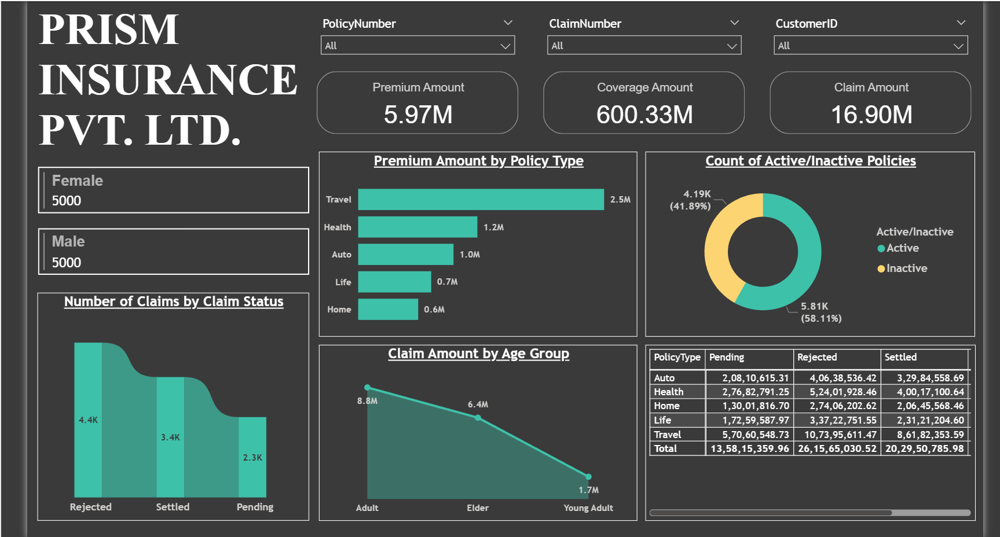

# Insurance Data Analysis – Power BI Dashboard

## 📌 Project Overview
This project analyzes insurance data using Microsoft Power BI to generate meaningful insights related to claims, premiums, and customer behavior.

---

## 🎯 Objectives
- Analyze insurance claims trends
- Understand customer segmentation
- Compare premium amounts vs claim amounts
- Build interactive dashboards for business insights

---

## 📊 Dashboard Highlights
- Claims analysis and frequency
- Customer demographic insights
- Premium distribution
- Policy performance overview

---

## 🛠 Tools & Technologies
- Power BI
- DAX
- Data Modeling
- Data Cleaning

---

## 📁 Project Files
- `Insurance_Data_Analysis.pbix` – Power BI file
- `screenshots/` – dashboard images

---

## 📸 Dashboard Preview

---

## 🚀 How to Use
1. Download the `.pbix` file
2. Open it in Power BI Desktop
3. Refresh the data if required
4. Explore the interactive visuals
